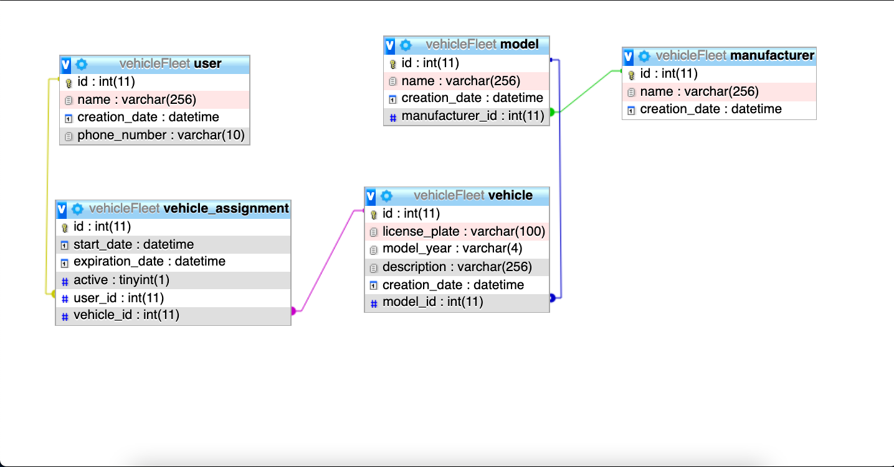
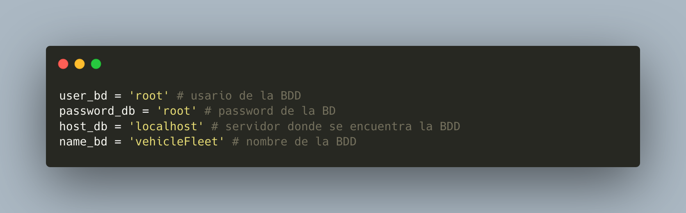
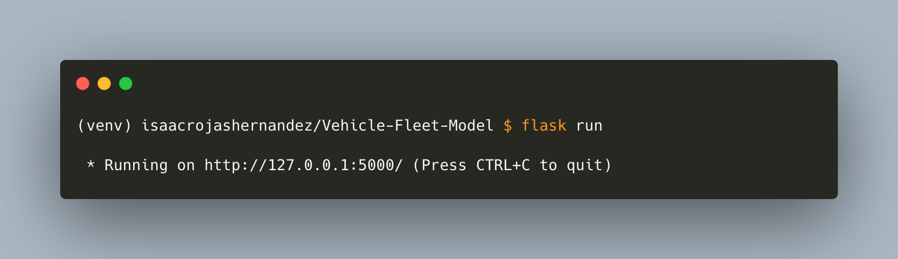
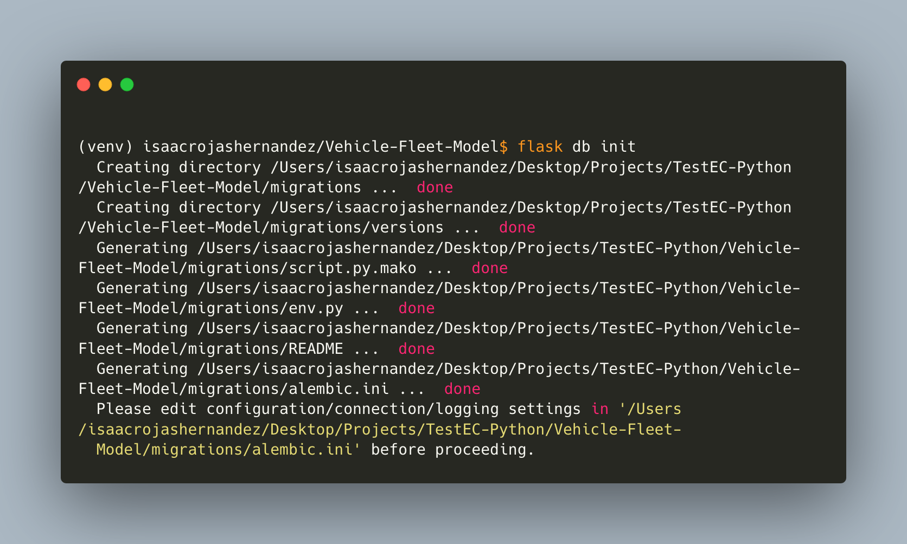
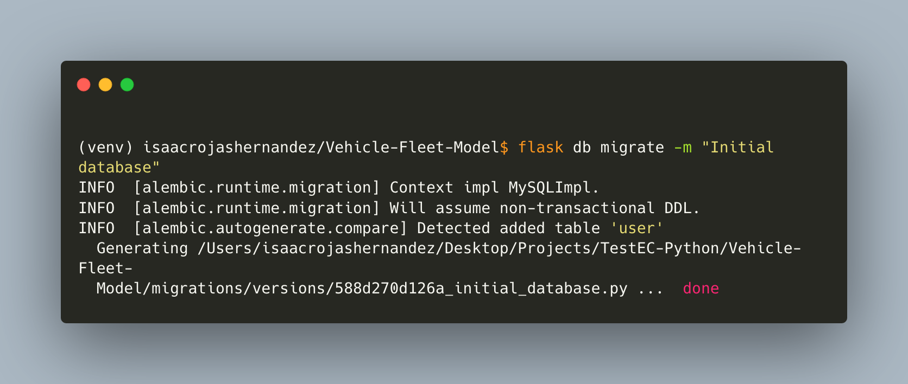
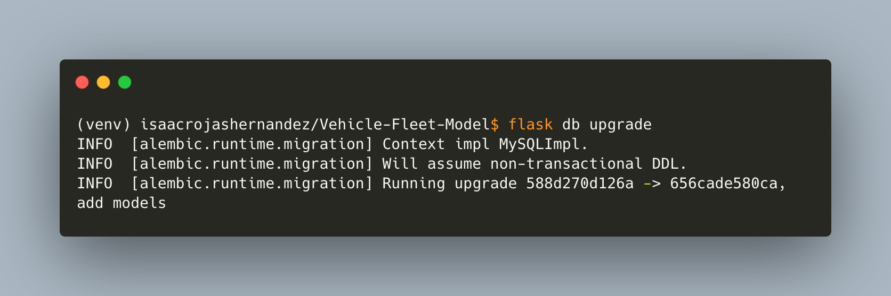

# TestRC-Python
### SECCION B

```
Para este ejercisio, el esquema DB, está de la siguiente manera
```



> El modelado del esquema BD , se hizo mediante el ORM **_SQLAlchemy_** utilizando **_Flask_** como framework

> Los requirimientos para ejecutar la app, son los siguientes

```
Python3
virutalenv

```
## Pasos para instalación e instalación de requerimientos

Es necesario navegar hasta la carpeta **_Vehicle-Fleet-Model_**

Dentro de la carpeta será necesario crear un entorno virutal de la siguiente forma

`$virutalenv venv --python=python3.7`

Una vez hecho esto, se creará una carpeta llamada venv, la cual tendrá todo lo necesario para ejecutar la apliación

Para activar el entorno virutal es de la siguiente manera

`$source venv/bin/activate`

En la terminal se antepondrá el (venv), indicando que estamos dentro del entorno virtual

Hecho esto, es neceario ejecutar el archivo **_requitements.txt_** el cul tendrá todas las herramientas necesarias para ejecutar la aplicación, se hace de la siguiente manera

`$pip3 install -r requirements.txt`

Será necesario actualizar las variables de configuración dentro del archivo config, esto para la conexión a la BDD, el cual está en la siguiente ruta 

`Vehicle-Fleet-Model/app/config.py`




Una vez hehco esto, ya podemos correr la aplicación con el siguiente comando

`$flask run`



## Ejecución de Migraciones
Para ejecutar las migraciones se hará uso de los siguientes comando

> Inicializar las migraciones

`$flask db init`



> Generar los ficheros que contendrán los cambios para actualizar la BDD

`$flask bd -m 'Initial database'`



> finalmente ejecutamos el siguiente comando para actualizar y agregar los modelos a la BDD

`$flask db upgrade`
