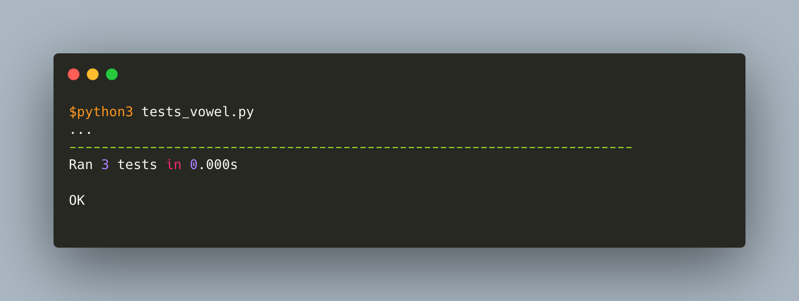

## TestRC-Python
> Para ejecutar el ejercisio de las vocales será de la siguiente manera

> `$python3 vowels.py`

> La ejecución de las pruebas de este ejercicio es de la siguiente forma

> `$python3 tests_vowel.py`

